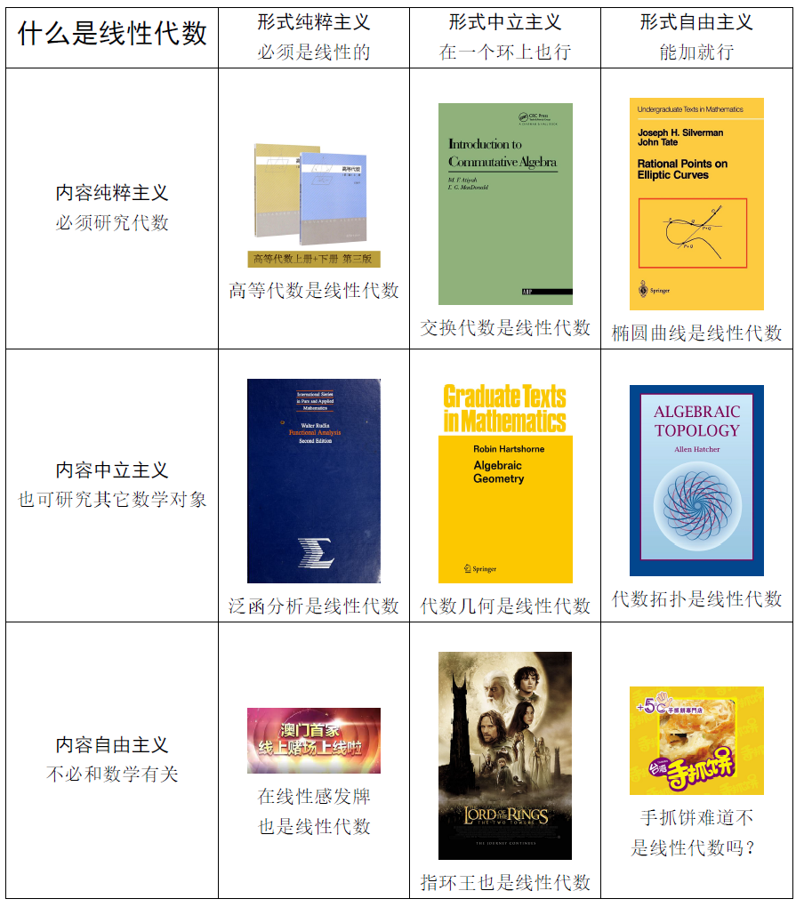

I am serving as a Teaching Assistant for Advanced Algebra II taught by Prof. Fuzheng Wang in the 2024 Spring semester. I grade exercises and exam papers and I also teach a series of lessons on advanced algebra problem solving.

 # Information about the lessons on problem solving (习题课信息)

Location: 204, the scientific teaching building (理教204)

Time: 18:40-20:30, Thursday on the even weeks (双周周四晚18：40-20：30)

Material: [Lecture notes (自编讲义)](https://github.com/xiaxueqaq/Advanced_Algebra_II_notes)

