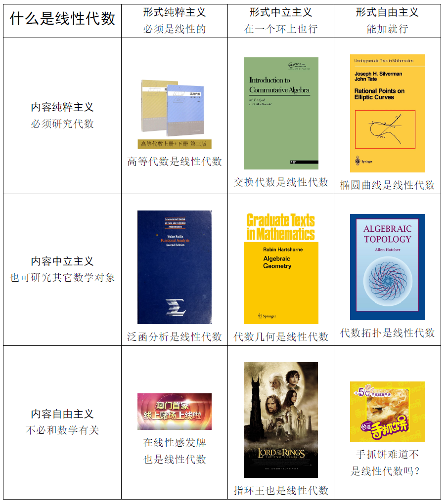

I am serving as a Teaching Assistant for Advanced Algebra II taught by Dr. Xia Gao in the 2025 Spring semester. I grade exercises and exam papers and I also teach a series of lessons on advanced algebra problem solving.

Ratio / 分数比例: 

Homework : Midterm : Final (平时/期中/期末) = TBA (暂时不能给你明确的答复)

 # Information about the exercise session (习题课信息)

Location: Room 414, Second Teaching Building (二教414)

Time: 18:40-20:30, Thursday on the even weeks (双周周四晚18：40-20：30)

Material: [Lecture notes (自编讲义)](../files/Lecture_Notes(2024).pdf)

Please hand in your homework in **paper form** before the class begins / 请在课前提交**纸质版**作业

No late submission. Submission after the final is strictly **PROHIBITED** / 请勿迟交作业，**严禁**期末考试后补交

